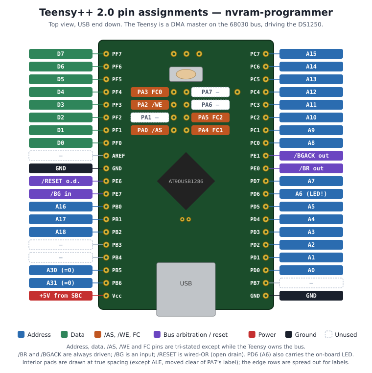

# nvram-programmer

In-circuit programmer for a Dallas DS1250Y 5V NVSRAM, controlled from a host PC over USB.
The NVRAM is the boot ROM of a Motorola 68030 single-board computer. The programmer, a
5V Teensy++ 2.0 (AT90USB1286), takes the 68030's bus with the normal bus-arbitration
handshake, programs or reads the NVRAM as a DMA master, then hands the bus back and
resets the CPU — so the chip never leaves the board.

## Hardware

- **Target chip:** Dallas DS1250Y-70 NVSRAM, 512K × 8, 19-bit address
- **Programmer:** Teensy++ 2.0 (5V, AT90USB1286)
- **Target CPU:** Motorola 68030 at 16 MHz
- **Host interface:** USB CDC serial, 115200 baud
- **Power:** from the SBC's 5V rail, not USB — the Teensy's USB power trace is cut, so the
  cable carries data only. The programmer only appears on USB while the SBC is powered.

### Pinout



| Signal   | Teensy pin | Direction     | Notes                                               |
|----------|------------|---------------|-----------------------------------------------------|
| A[7:0]   | PD[7:0]    | output        | tri-state unless the programmer owns the bus        |
| A[15:8]  | PC[7:0]    | output        | tri-state unless the programmer owns the bus        |
| A[18:16] | PB[2:0]    | output        | tri-state unless the programmer owns the bus        |
| A24, A25 | PB5, PB6   | output        | driven 0 while the bus is owned                     |
| D[7:0]   | PF[7:0]    | bidirectional | tri-state at idle                                   |
| /AS      | PA0        | output        | strobed once per byte                               |
| /WE      | PA2        | output        | held low for a whole write burst                    |
| FC0–FC2  | PA3–PA5    | output        | driven 000 while the bus is owned                   |
| /BR      | PE0        | output        | bus request                                         |
| /BGACK   | PE1        | output        | bus grant acknowledge                               |
| /RESET   | PE6        | open drain    | pulsed low for 500 ms, otherwise high-Z             |
| /BG      | PE7        | input         | bus grant from the 68030                            |
| /OE      | —          | —             | tied low on the SBC                                 |

At power-up every bus pin is tri-stated so the 68030 boots normally from the NVRAM.

> **Note:** PD6 (A6) also drives the Teensy's on-board LED. The LED loads the A6 line even
> while the pin is tri-stated, and flickers with SBC address activity. Removing the LED's
> series resistor fixes it.


### Bus arbitration

To take the bus the programmer asserts /BR, waits for the 68030 to assert /BG, asserts
/BGACK, negates /BR, then drives the address, data, /AS, /WE and FC pins. To give it
back it negates /AS and /WE, tri-states those pins, then negates /BGACK.

## Firmware

Built with [PlatformIO](https://platformio.org/):

```
pio run -t upload
```

## Host tools

Build with `make`. All three default to `/dev/ttyACM0`; override with `--port DEV`.

| Tool | Usage | What it does |
|------|-------|--------------|
| `nvram_write` | `./nvram_write [--port DEV] <binary>` | Programs the file from address 0, reads it back, and reports `Verified.` or the first mismatch. The SBC is reset afterwards. |
| `nvram_read`  | `./nvram_read [--port DEV] [--length N] <outfile>` | Reads N bytes (default 512 KB) from address 0 into a file. |
| `nvram_reset` | `./nvram_reset [--port DEV]` | Resets the SBC without reprogramming, so it reboots from the current NVRAM contents. |

## Serial protocol

The host sends a one-byte command. `W` and `R` are followed by a 4-byte little-endian
length; `W` is then followed by that many bytes of data. A 5-second gap between bytes
aborts a transfer.

| Command | Action | Reply |
|---------|--------|-------|
| `W` | Take the bus, write the data from address 0, read it all back, release the bus, pulse /RESET | The read-back bytes, then `Done.` |
| `R` | Take the bus, read from address 0, release the bus | The raw bytes |
| `X` | Pulse /RESET for 500 ms (bus not touched) | `Done.` |

Each /AS strobe is 375 ns wide (6 NOPs at 16 MHz), comfortably longer than the DS1250-70's
70 ns access time.
