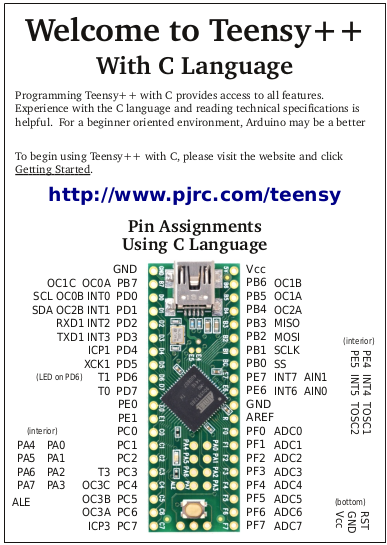

# nvram-programmer

In-circuit programmer for a Dallas DS1250 5V NVSRAM, controlled from a host PC over USB. The programmer hardware is a 5V Teensy++ 2.0 (AT90USB1286).

## Hardware

- **Target chip:** Dallas DS1250 5V NVSRAM (256K × 8-bit, 18-bit address bus)
- **Programmer MCU:** Teensy++ 2.0 (5V, AT90USB1286)
- **Host interface:** USB CDC serial at 115200 baud



### Pin mapping (Teensy++ 2.0)

| Signal  | AVR port/pin  |
|---------|---------------|
| A[7:0]  | PORTD         |
| A[15:8] | PORTC         |
| A16     | PORTE[0]      |
| A17     | PORTE[1]      |
| D[7:0]  | PORTF         |
| /OE     | PORTE[6]      |
| /WE     | PORTE[7]      |

## Build system

Uses **PlatformIO**. The predecessor Arduino IDE project lives at `../arduino-nvram-programmer/`.

Build and upload:
```
pio run -t upload
```

Open serial monitor:
```
pio device monitor -b 115200
```

## Serial protocol

The host sends a single command byte followed by a raw binary payload:

| Byte | Meaning |
|------|---------|
| `W`  | Write (program) — host streams binary data; Teensy writes sequentially from address 0 |
| `R`  | Read/verify — host streams expected binary data; Teensy reads each byte and compares |

A 5-second inter-byte timeout ends the transfer. The Teensy reports progress as dots (one per 1 KB, newline per 64 KB) unless `DEBUG` is defined, in which case a full hexdump is printed.

## Key source functions

- `bus_request()` — asserts control: sets address/data/control pins to output, drives address to 0
- `bus_release()` — tri-states all bus pins so the target system can resume
- `write_byte(addr, data)` — places address and data on bus, pulses /WE low then high
- `read_byte(addr)` — places address on bus, asserts /OE, reads PORTF

## TODOs in existing code

- `/BUSRQ` assertion/release (bus arbitration with the target CPU) is not yet implemented
- `/CE` assertion/release is not yet implemented
- `/RESET` pulse after bus release is not yet implemented
